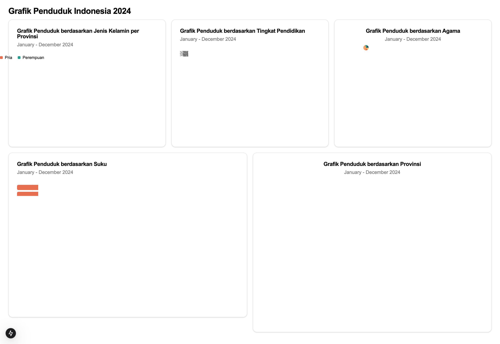
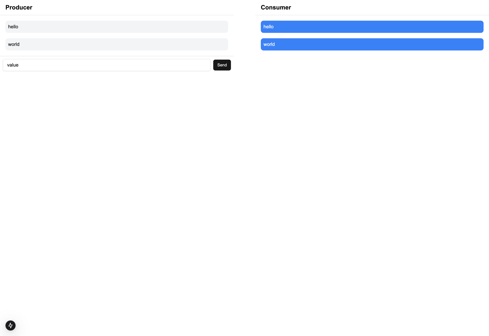

## 📖 About the Project

This is a **fullstack application** using:

- **Frontend:** Next.js (React + RTK Query) - http://localhost:3003
- **Backend:** NestJS (REST API) - http://localhost:10050
- **Database:** PostgreSQL
- **Message Broker:** Kafka with Zookeeper

## 📌 Prerequisites

Before running the application, ensure you have:

- **Docker** installed → [Download Here](https://www.docker.com/get-started)
- **Docker Compose** installed

## ⚡ Installation and Running the App

### Clone the Repository

```sh
git clone https://github.com/arywr/fullstack-techical-test.git my-app
cd my-app
```

## Project Structure

    .
    ├── server                  # Server app
    ├── client                  # Client app
    └── README.md

## Run using docker compose

```bash
# Run to execute docker startup
$ docker compose up -d --build

# Run to stop the app
$ docker compose down
```

## Results



